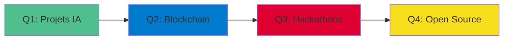

<div align="center">

# 👋 Coovi Quenum

### Développeur Full-Stack | Marketing → Tech Transition

[](https://www.linkedin.com/in/coovi-quenum-6a05a2333/)
[](#)
[](mailto:votre.email@example.com)

</div>

---

## 🚀 Qui suis-je ?

Développeur full-stack passionné avec un background unique en **marketing et commerce**. Cette double expertise me permet de créer des solutions techniques qui répondent aux vrais besoins business.

```typescript
const coovi = {
  role: "Développeur Full-Stack en Alternance",
  background: "Marketing Communication & Commerce",
  passion: ["Innovation", "Clean Code", "User Experience"],
  currentFocus: "Building impactful web solutions",
  openTo: ["Collaborations", "Open Source", "Tech Talks"]
};
```

---

## 💼 Compétences Techniques

<table>
<tr>
<td valign="top" width="33%">

### Frontend
<div align="center">


</div>

</td>
<td valign="top" width="33%">

### Backend
<div align="center">


</div>

</td>
<td valign="top" width="33%">

### Database & Tools
<div align="center">


</div>

</td>
</tr>
</table>

---

## 📈 GitHub Analytics

<div align="center">
  
  
</div>

<div align="center">
  
</div>

---

## 🎯 Roadmap 2024



- ✅ Maîtriser TypeScript avancé
- 🔄 Développer 2 projets innovants (IA/Blockchain)
- 📅 Participer à 3+ événements tech
- 🌟 Contribuer à l'open source régulièrement

---

## 🏆 Highlights

<div align="center">

| 🎓 Formation | 💼 Expérience | 🚀 Projets |
|:---:|:---:|:---:|
| Marketing → Dev | Full-Stack Alternance | 10+ Projets Web |
| Auto-formation | Méthodologies Agiles | Stack Moderne |

</div>

---

## 💬 Let's Connect!

<div align="center">

**Ouvert aux opportunités de collaboration et d'échange**

[](https://www.linkedin.com/in/coovi-quenum-6a05a2333/)

</div>

---

<div align="center">
  
  
  <br/>
  
  <i>💡 "Du marketing au code : transformer les idées en solutions digitales"</i>
</div>
